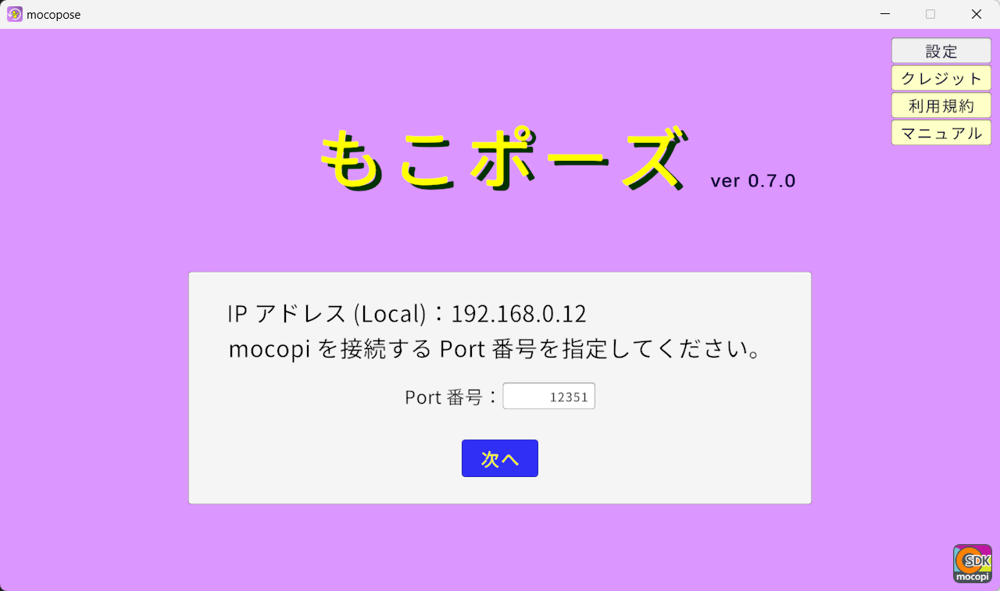
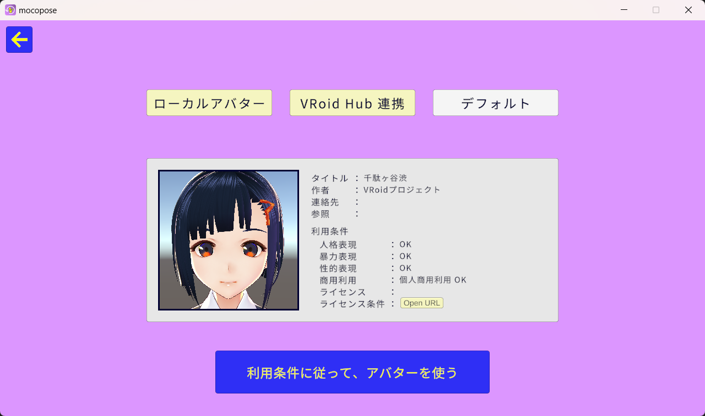

# mocopose (もこポーズ) マニュアル
アプリバージョン：0.2

## mocopose とは？
モーションキャプチャセンサ及びスマートフォンアプリの mocopi を使い 
手軽に 好きなポーズ のサムネイル素材を制作できる Windows アプリです。

## 使い方概要
1. mocopose アプリを起動します
2. タイトル画面で mocopi に関する情報を確認し、mocopi アプリを設定します
3. アバター選択画面で VRM 形式のモデルを読み込みます
4. mocopi アプリでの動きが mocopose アプリ画面上のアバターに反映されていることを確認します
5. 撮影画面でカメラやアバターの調整を行います
6. シャッターを切ります
7. プレビュー画面でカメラ、アバター、ポーズタイミングの調整をして画像を保存します

## ファイアーウォール警告画面について
アプリ実行中にファイアウォールに関するダイアログが出ることがあります。 
外部アプリとの連携に必要となりますので、許可をお願いします。

## 画面ごとの説明

## 1. タイトル画面

- ローカルネットワーク上の IP アドレスが表示されます
   - mocopi アプリの PC 接続設定のためにご参照ください
  
- mocopi アプリからの通信を受け取るポート番号を指定します
   - mocopi アプリの PC 接続設定における送信ポート設定と番号を合わせてください
   - 撮影画面でも ポート番号は設定可能ですので、デフォルトのまま進めても大丈夫です
  
- 「クレジット」ボタンを押すことで、アプリで利用している素材のクレジットが見られます
   - 暗くなっている背景部分を押すことで、元の画面に戻れます
  
- 「利用規約」ボタンを押すことで、アプリの利用規約のページ（外部ページ）を開きます
  
- 「マニュアル」ボタンを押すことで、このマニュアルページ（外部ページ）を開きます
  
- ポート番号を設定した状態で、「次へ」ボタンを押すことによりアバター選択画面に移動します
  

## 2. アバター選択画面

- 「アバターを読み込む」ボタンを押すことでダイアログが表示され、読み込みたい VRM モデルを選択できます
   - 読み込み後 VRM モデルの情報を参照できます
  
- 「デフォルトを選択」ボタンを押すことで、アプリに設定されたデフォルトの VRM モデルが読み込まれます
  
- VRM のモデル情報のうち、ライセンス条件が設定されているモデルについては、その条件を確認することができます
   - 「OpenURL」ボタンを押すことで、ライセンス条件項目に設定されたリンクの外部ページを開きます
  
- 「利用条件に従って、アバターを使う」ボタンを押すことにより撮影画面に移動します
  

## 3. 撮影画面

- マウス操作
   - 右クリックを押したままマウスを移動させることで、カメラを平行移動させることができます
   - マウスのスクロールにより、アバターの大きさを変えることができます
  
- 左上の「×」ボタンを押すことで、UI の表示を制御します
  
- 「設定」ボタンを押すことで、設定画面を開きます
   - 暗くなっている背景部分を押すことで、元の画面に戻れます
  
- 「カスタム」ボタンを押すことで、カスタム画面を開きます
   - 背景部分を押すことで、元の画面に戻れます
  
- 「初期位置」ボタンを押すことで、カメラの位置及びアバターの大きさを初期状態に戻します
   - さらにアバターの腰を基準として、カメラを正面に移動させます
  
- 「左右反転」ボタンを押すことで、カメラの映像を左右反転させます
  
- 中央下の丸いシャッターボタンを押すことで、5 秒のカウントダウンの後シャッターが切られ、プレビュー画面に遷移します
   - シャッターが切られたタイミングで、アバターのポーズを固定します
  

### 3-a. 設定画面

- ローカルネットワーク上の IP アドレスが表示されます
  
- mocopi の送信ポート番号を入力したうえで「変更」ボタンを押すと、ポート番号を変更できます
  
- 「読込」ボタンを押すことでダイアログが表示され、読み込みたい画像 (PNG, JPEG) を選択できます
   - 画像はウィンドウのサイズに合わせて拡縮されます   
  
- 透過画像の出力を有効にすることで、デフォルトで出力される、背景＋アバターの画像のほか、アバターのみを透過した画像も加えて出力できます
  
- 「開く」ボタンを押すことで、出力した画像を保存する場所をエクスプローラーで開きます 
  
- 「戻る」ボタンを押すことで、アバター選択画面に移動します
  

### 3-b. カスタム画面

- 各表情の設定値をスライダーで変更できます
   - スライダ―の右にあるボタンで設定値を初期化できます 
  
- 左右それぞれの手指ポーズを選択できます
  
- アバターの向きを「回転」スライダーで変更できます
   - スライダ―の右にあるボタンで設定値を初期化できます 
  

## 4. プレビュー画面

- 撮影画面と同じくマウス操作が可能です
  
- 「×」ボタンを押すことで、UI の表示を制御します
  
- 「ポーズのタイムライン」スライダーを移動させることで、数秒前までのポーズを再現します
  
- 「画像」ボタンを押すことで、画像を読み込みます
  
- 「位置」ボタンを押すことで、カメラの位置及びアバターの大きさを、シャッターを切った時点の状態に戻します
  
- 「反転」ボタンを押すことで、カメラの映像を左右反転させます
  
- 「カスタム」ボタンを押すことで、カスタム画面を開きます
  
- 「保存」ボタンを押すことで、画像を保存します
  
- 「戻る」ボタンを押すことで、撮影画面に戻ります 
  

以上。
